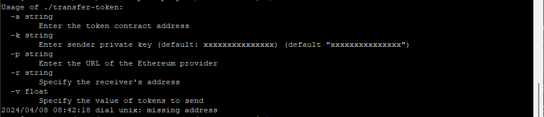

# Token Transfer CLI
Transfer tokens easily on the Ethereum blockchain using this command-line interface (CLI) tool! 🚀

## Installation

Clone the repository:

```bash
git clone https://github.com/birdsofspace/token-transfer-cli.git
cd token-transfer-cli
```

Build the executable:

```bash
go build -o transfer-token main.go
```

## Usage

```bash
./transfer-token -a <token_contract_address> -k <private_key> -p <ethereum_provider_url> -r <receiver_address> -v <token_amount>
```

### Flags

- `-a`: Enter the token contract address.
- `-k`: Enter the sender's private key. Default is `xxxxxxxxxxxxxxx`.
- `-p`: Enter the URL of the Ethereum provider.
- `-r`: Specify the receiver's address.
- `-v`: Specify the value of tokens to send.

Example:

```bash
./transfer-token -a 0x123abc... -k abcdef123... -p https://provider.url -r 0x456def... -v 100.5
```

## Contributing

Contributions are welcome! Fork the repository and submit a pull request with your changes.

## License

This project is licensed under the MIT License - see the [LICENSE](LICENSE) file for details.

